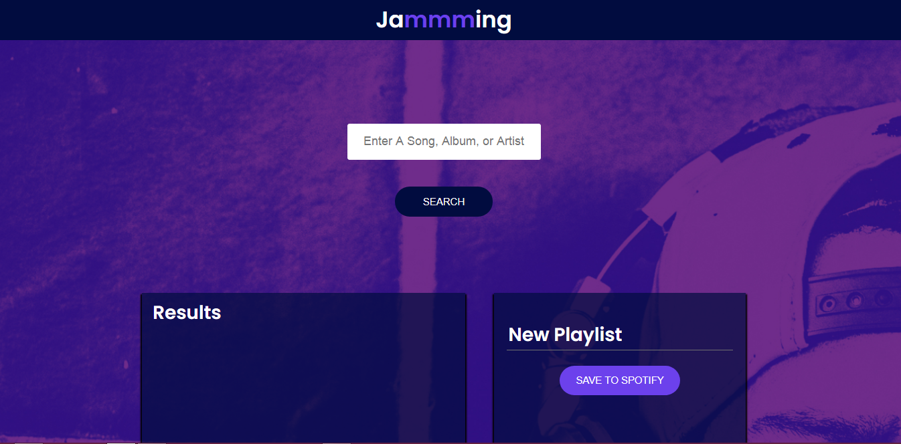
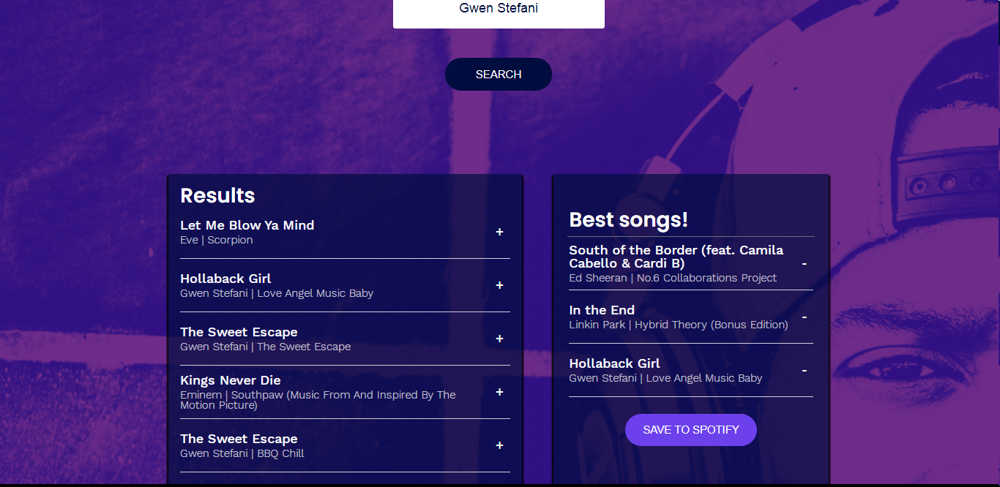

# Project Jammming

This project was bootstrapped with [Create React App](https://github.com/facebook/create-react-app). I built this project as a part of CodeCademy course. The App allows users who are registered at Spotify to search for songs and create new, customized Playlists which they can save to their Spotify accounts.

### `npm start` in the root directory

Runs the app in the development mode. 
Open [http://localhost:3000](http://localhost:3000) to view it in the browser.

#### Homepage of Jammming

#### Customizing a Playlist

