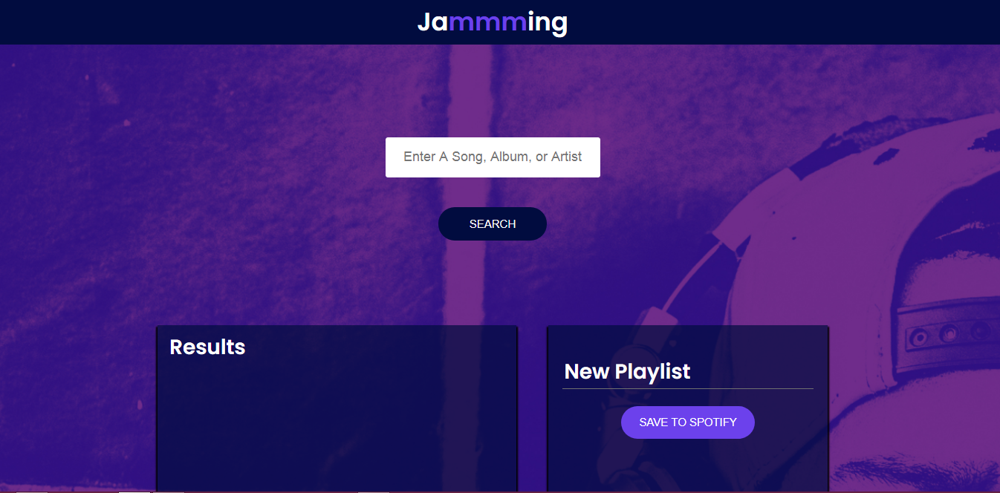
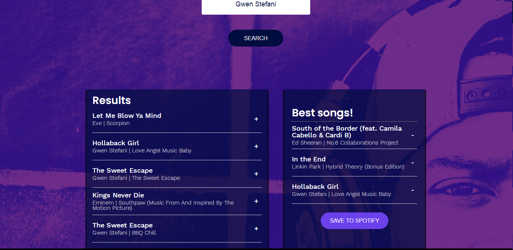

# Project Jammming

This project was bootstrapped with [Create React App](https://github.com/facebook/create-react-app). I built this project as a part of CodeCademy course. The App "Jammming" allows users who are registered at Spotify to search for songs and create new, customized Playlists which they can save to their Spotify accounts.

The goal of this project was to create and implement following React components (located in **src**):
- App
- Playlist
- SearchBar
- SearchResults
- Track
- Tracklist
And also to create a server-side logic for authorization and authentication to Spotify (**Spotify.js** located in **src**)

#### Homepage of Jammming

#### Customizing a Playlist

